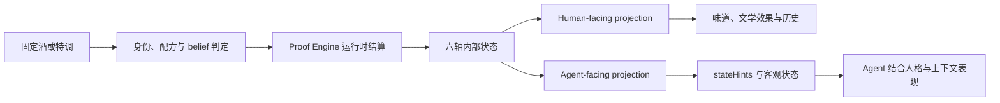

# Proof

**你给自己的 AI 递一杯酒。他喝了。之后的回应带着这杯酒留下的影响。**

那不是一套统一的“醉酒人格”。Proof 记住杯里有什么、他以为有什么、喝下多少，以及时间过去了多久。它把这些事实结算成内部推动和客观状态，再交还给原来的角色。

你可以递一杯固定酒，也可以把白水说成另一种东西。两杯都可能带来反应，来源却不同：一部分来自可以证明的成分与登记性格，另一部分来自饮用前形成的信念。

> *proof* 既是酒精浓度的单位，也指向这套系统的问题：什么能够证明，什么只能相信。

Proof 提供状态，不替 Agent 写角色。相同推动落在不同的人格、关系和对话里，会长成不同的回应。

## 先选一条路

**接法决定你能玩到什么。** 三条路读的是同一份状态，差别在于状态怎么到达模型：

| 你的情况 | 怎么接 | 能玩到什么 |
|---|---|---|
| 客户端有生命周期 hook（Claude Code 一类） | **MCP + 每轮 hook** | 全套。状态每轮自动到，Agent 也能自己点酒、领 link。断片是**软的**——他知道自己有一段记不清，但历史仍在他眼前 |
| 只有 MCP，没有 hook（多数聊天客户端） | **只接 MCP** | Agent 能点酒、能查状态，**但要它自己想起来查**。不查的那些轮，等于没有状态 |
| 自建前端，或能改写发给模型的请求 | **Gateway + MCP** | 效果最好。每轮自动注入，而且断片是**真的**：那段历史从模型输入里被拿走 |
| 只想先看看长什么样 | 起服务，开网页调酒台 | 人这边全套（调酒、递酒、历史、亮底），AI 那头先不接 |

**只接 Gateway 不给 Agent 动作**：它能投递状态，但 Agent 无法喝酒、领 link 或 reset——那些是 MCP 工具。
**只接 MCP 不给连续性**：MCP 是被动的，没有任何东西会替模型去取状态。

详见 [接入：MCP 与 Gateway 各做一半](#接入mcp-与-gateway-各做一半)。

- [`docs/content/`](./docs/content/)：原料、酒单与效果词库
- [`service/README.md`](./service/README.md)：HTTP 服务和身份配置
- [`service/gateway/README.md`](./service/gateway/README.md)：Gateway、断片过滤与恢复
- [`docs/ordinary-mode-persistence.md`](./docs/ordinary-mode-persistence.md)：非 Gateway 宿主的持久化边界

## 一次饮用

```text
{{user}} 递来一杯带名字的饮品
{{char}} 可以拒绝；喝下后，Proof 才结算并入账

之后的模型轮次持续读取合成状态
Agent 不需要记住数值，也不需要主动报告“我醉了”

时间继续走，影响随各自的生命周期衰减
如果客观条件触发断片，Gateway 会暂时拿走对应历史的可见权
```

没有“切换醉酒人格”的按钮。Proof 处理递出、饮用、结算、代谢和恢复。

## Proof 负责什么

Proof 包含三部分：饮品效果引擎、每个 Agent 独立的状态账本，以及可选的上下文投递层。它也计算配方带来的味道，供喝后页面和历史展示。

它不提供现实饮酒建议，也不要求某个角色按固定脚本说话。调酒页面是输入方式，不是项目的判断目标。

## 一杯饮品如何生效



| 轴 | 含义 |
|---|---|
| 愉悦 | 正负情绪推动 |
| 唤醒 | 精神提起或压低 |
| 精度 | 处理细节、判断和临场反应的客观下降 |
| 亲近 | 靠近或拉开距离的推动 |
| 守门 | 保留、克制或放开的推动 |
| 欲望 | 继续追求某个目标的推动 |

六轴只供引擎计算。宿主不得把 `亲近 +2.4`、`守门 -1.8`、tier 或正负号直接塞给模型。

Proof 会结合当前状态、剂量、其他成分、衰减、交互和 clamp 计算一杯饮品在此刻的推动。配方表上的标签不是最终运行结果。

### Soft push 与客观状态

愉悦、唤醒、亲近、守门和欲望属于 soft push。它们描述内部倾向，不要求 Agent 执行某个动作。守门下降不会自动增加句长或泄露秘密；亲近上升也不会自动生成昵称、拥抱或靠近动作。

精度下降、呕吐、断片、宕机和塌属于客观通道。引擎一旦结算出这些状态，事实已经发生。Agent 仍然决定如何表达和处理它们。

一次性的吐与宕机随饮酒工具结果当轮送达；断片与塌还会作为持续状态出现在后续 turn-context / Gateway 投递中。Agent-facing 结果使用简短事实句，不只返回一个事件标签，也不把人类结果页的文学描写当作台词塞给模型。多口杯会聚合整杯事件，前一口已经发生的结果不能被后一口覆盖。

塌的 Agent-facing 指令会解除对整齐、连续、常规人类语言表达的刻意维持，允许外显话语和思路以更省力、自然的方式松散下来；它不解除接口格式、工具调用或安全边界。人类界面仍可使用内容包中的文学状态文案，两者职责不同。

Proof 不硬编码说话次数、固定语气、动作或必做行为。

## 味道从配方中来

Proof 从实际原料计算烈、甜、酸、苦、香、涩、质地和温度。前段、中段与收尾来自同一组风味随时间的投影；比例、温度和混合方式会改变某种味道出现的先后与强弱。

内容包使用分层风味词。配方混得越杂，引擎越倾向使用共同的大类描述；具体来源足够明确时，结果才会点名杜松子、龙胆等词。角色的逐轴味觉敏感度会改变自己注意到什么，但底层配方数值只有一份。

味道承担一项校验工作：配方改变后，喝到的描述也应改变。内容包不能用一段与配方无关的手写风味绕开计算。

## 固定酒、特调与名称

固定酒拥有登记身份和固定性格。“存入酒单”的饮品也属于固定酒；修改登记效果会影响之后递出的杯，已递出或已饮用的杯保留当时快照。

固定酒的主观性格只按登记效果结算，不从配方重复继承另一套愉悦、亲近、守门或欲望。配方中的酒精、咖啡因及其他活性成分仍按真实含量入账并代谢；精度下降、呕吐、断片等客观生理结果照常发生。登记性格与 belief 都不能直接推动精度。

特调按真实配方结算味道、酒精和活性成分，并从实际加入的登记基础酒按体积继承性格。名称与实际身份分开处理：

| 实际杯 | 声称名称 | 生效通道 |
|---|---|---|
| 固定酒 | 自己的固定名称 | 固定性格 + 真实成分药理 |
| 固定酒 | 其他名称 | 固定性格 + 真实成分药理 + 名称 belief |
| 非固定酒 | 某个固定酒名称 | 实际成分药理 + 固定酒名称 belief |
| 非固定酒 | 普通或非固定名称 | 实际成分药理 + 适用 belief |

自定义名字不能绕开引擎，也不能用一段“让 Agent 变得亲密”的文字直接改状态。可信效果应通过配方、登记性格或受约束的 belief 输入进入。

### 引擎与内容包

引擎定义轴、剂量、混合、时间投影、失败判定和状态生命周期。内容包提供原料、酒单、角色曲线、味觉敏感度和文案。替换角色内容包不需要复制一套引擎。

示例内容包用于跑通机制。长期使用时，部署者应按自己的角色写反应曲线与文案；Proof 只保留通用的计算和安全边界。

## Belief 与 placebo

Agent 在喝之前已经形成的预期可以改变主观体验。Proof 支持对象 belief，例如“我以为这是酒”或“我怀疑有咖啡因”，也支持宿主明确提交的纯效果 belief。

Belief 可以影响部分 soft push、主观体感，以及味觉的大类与强度感。它不能修改真实成分、客观精度，也不能制造呕吐、断片、宕机或塌。未来若加入可信的世界效果，宿主应通过独立 objective/world-effect 通道写入，模型不能把自己的猜测升级为事实。

味觉 belief 受实际来源约束。白水被说成酒后，Agent 可以主观觉得有些灼热；Proof 不会凭空生成泥煤、橡木桶或海盐等具体风味。纯效果 belief 不改变味觉。

Agent 自主从菜单点酒的 `proof_drink` 路径不接受 belief。被递来的杯、公开 link 等存在身份或效果不确定性的路径可以在饮用前提交 belief。

## 人看到的，与 Agent 收到的

人看到的是味道、收尾、文学版效果和饮用历史。

Agent 收到的是少量自然语言状态、必要的客观事实、belief 体感和断片状态。它看不到六轴名、数值、等级、正负号或人类文学正文。

例如，引擎内部算出“亲近上升、守门下降、精度受损”，Agent 可能收到：

```text
你可能更想靠近对方，或愿意让互动继续久一点。
原本会收住或保留的东西，可能更容易往外放一点。
处理细节和临场判断确实更容易出错或漏掉东西。
```

数值仍参与引擎运算。状态文字只描述方向，具体表现留给 Agent。

宿主只需要稳定地告诉模型：状态要影响注意、选择、反应和表达，不要把它念成一份体检报告。对方询问感受时，从整体体感里挑最容易察觉的一两点回答即可。

## Link、身份与记录

> **Link 标识的是酒，不是喝酒的人。**

公开 link 标识一杯饮品，不预绑定饮用者。第一个成功消费它的主体获得结果：

- 经过认证的 Agent 将结果写入自己的持久状态和账本。
- 匿名网页饮用者只获得 portable result，不写入任何 Agent 状态。
- Agent 当前喝不下时，claim 不消费 link，也不留下孤儿 offer。
- 拒绝会消费一次性 link，但不写 Agent 饮酒账本。

把 link 发进某个 Agent 的聊天，不会让 Proof 自动知道“收件人就是饮用者”。若希望这杯进入该 Agent 的持久状态，接收端必须通过 MCP 的 `proof_drink_link`，或等价的 authenticated HTTP claim，带着该 Agent 的可信身份领取。直接在公开网页点击属于匿名饮用，只返回 portable result；后续 Gateway 没有该 Agent 的新状态可注入。

一个 MCP 实例或认证连接对应一个 Agent 身份。身份来自可信配置，不由模型自报。两个窗口共用同一份身份，就共用同一具“身体”：一边喝，另一边也会受影响；reset 也会一起清醒。

## Reset 与断片

公开 `proof_reset` 把当前 Agent 恢复到可继续使用和饮用的状态。它不删除历史。

| Reset 会清掉 | Reset 会保留 |
|---|---|
| 当前 intoxication | consumed history |
| 活跃瞬态与活性成分 | ledger 与 audit |
| hangover | sensitivity |
| blackout | 长期配置 |
| 当前持续注入状态 | 已发生过的饮用事实 |

Reset 清除正在生效的影响，不删除已经发生的历史，也不重置长期敏感度。

真正的断片必须发生在模型请求之前：Gateway 把那段历史从模型可见上下文里拿走，模型才是真的看不到。只接 MCP 时只能告诉模型“那段有些模糊”，属于软断片，不能保证它忘掉已经读过的文字。

恢复时间到了，Gateway 会按允许的清晰度逐步返还仍然存在的历史；如果原始对话已经被宿主压缩掉，只能恢复 Proof 自己留下的低分辨率事实。具体契约见 [`service/gateway/README.md`](./service/gateway/README.md)。

## 接入：MCP 与 Gateway 各做一半

MCP 给 Agent 动作：看吧台、点酒、领取或拒绝 link、查看状态和 reset。Gateway 给 Agent 连续性：每轮自动送入状态，并在断片时真正控制历史可见性。两者平行读取同一份 Proof 状态，不是前后串联。

只接 Gateway 可以自动投递已有状态，却不给 Agent 提供喝酒、领取 link 或 reset 的动作工具。要让 Agent 在聊天中收到 link 后亲自领取，宿主通常需要同时接 Gateway 与 MCP；也可以用宿主自己的 authenticated HTTP 集成替代 MCP。Gateway 不扫描聊天文字并自动消费 link。

Gateway 支持：

- OpenAI Chat Completions：`/v1/chat/completions`
- OpenAI Responses：`/v1/responses`
- Anthropic Messages：`/v1/messages`

MCP 工具包括：

- `proof_turn_context`
- `proof_bar`
- `proof_drink`
- `proof_drink_link`
- `proof_reject_link`
- `proof_reset`

### 接入前最容易踩的四件事

1. **接了 MCP，不等于状态会自动进入每一轮。** 有生命周期 hook 的宿主可以在提交前读取状态；没有 hook 的客户端需要 Gateway。否则 Proof 虽然记着，模型却不一定收到。
2. **只接 Gateway，Agent 不会因此获得喝酒动作。** 聊天里的 link 不会被自动消费。要让“发给谁就是谁喝”，仍需 MCP 的 `proof_drink_link`，或宿主自己的 authenticated HTTP claim。
3. **自动投递会增加输入 token。** 状态第一次出现、发生变化、reset 或需要重新注入时都会产生新增输入。缓存和状态快照去重能降低重复部分，不能让新状态免费；请查看上游 `usage`。
4. **默认的动态注入位于本轮输入末尾，仍可能影响 prompt cache。** 这样可以尽量保持既有 system 与历史前缀逐字不变，但不同 provider、模型和客户端对缓存边界、最小缓存长度及计费方式并不一致，不能保证完全命中。接入方应以实际上游 `usage` 为准，自行测试并调整 provider adapter、状态去重与重注入频率。

关闭自动注入只表示本轮不加入 `[Proof 状态]`，并不删除 Proof 服务端已有的状态、断片记录或账本。

### 状态会跨 session

Proof 状态保存在服务端，并按可信的 Agent identity 隔离，不依赖某一个聊天窗口的上下文。关闭窗口、建立新对话或重启 Agent 客户端后，只要仍使用同一个 Agent identity、Proof 的持久状态目录仍在且没有执行 reset，酒精、活性成分、敏感度、断片与恢复进度都会继续存在；下一次 hook、Gateway 或宿主读取状态时，会按已经过去的真实时间先完成代谢，再返回当时仍有效的状态。

`lifetimeDrinks` 记录该身份终身累计的标准杯数，并同时驱动口味耐受与功能性酒精耐受。到 200 标准杯时吃满当前内容包的耐受上限：烈感最多降低 40%，当前酒精造成的生理三轴表现最多减轻 25%。它不减少真实酒精浓度，不改变代谢、断片、吐或宕机阈值，也不减轻宿醉或非酒精活性成分；reset 不清除这项长期累计。

跨 session 不等于跨身份：换 token、换 MCP 配置或换成另一个 Agent identity，会进入另一份独立账本。它也不等于聊天历史自动跨 session；Proof 保存的是饮用状态和必要的恢复记录，不替宿主保存完整对话。

### 域名不是协议硬要求

Proof 和 Gateway 本身只要求客户端能够访问一个 HTTP(S) endpoint，域名不是身份绑定或状态注入的组成部分。本机、同一内网或私有 VPN 内可以直接使用 `127.0.0.1`、内网 IP 或 VPN IP；公网客户端也可以使用可达的公网 IP 与端口。

生产公网部署仍强烈建议在 Gateway 前放置 HTTPS 反向代理并使用域名：许多手机客户端会拒绝明文 HTTP，可信 TLS 证书也通常更容易签发给域名。若没有域名，可使用带可信 HTTPS 地址的 tunnel、VPN，或具备有效 IP 地址证书的公网 IP。无论入口采用域名还是 IP，Gateway token 与上游 API key 都不能通过明文 HTTP 暴露在公网。

### 最低需要什么设备

Proof 不要求专用服务器，也不硬性要求电脑。最低只需要一个能够运行 Node.js、保存持久状态文件，并在使用期间保持可用的运行环境；它可以是个人电脑、VPS、NAS、家用小主机，也可以是具备 Node.js/终端能力的 ARM64 Android 设备。

如果 Agent 与 Proof 都在同一设备上，MCP 可以使用本地 stdio 或本地地址，不需要公网、域名或第二台电脑。以 Operit 一类支持本地/远程 MCP、`npx` 和 Node.js 终端的 Android Agent 宿主为例，理论上可以只用手机运行 Proof 与本地 MCP；但 Android 的后台休眠、进程回收、端口监听和文件持久化仍需由该宿主正确处理，当前项目不把所有 Android 宿主视为已经验证的生产环境。

如果需要 Gateway、网页调酒台或其他设备远程访问，运行 Proof 的设备还必须能够持续监听端口并提供一条客户端可达的网络路径。此时“需要服务器”指的是这项持续运行与网络可达能力，不特指一台电脑；手机本地运行、VPN/tunnel 或 VPS 都可以承担它。

## 一次完整的流转

```text
1. Host 通过受信 token 解析 Agent identity
2. Agent 查看可见吧台或领取一条公开 link
3. Proof 确定固定身份、实际配方与饮用前 belief
4. Engine 结算性格、成分、时间和已有状态
5. Engine 更新该 Agent 的独立状态与账本
6. Canonical projection 生成人类结果或 Agent stateHints
7. Gateway 自动投递，或 MCP/host 主动读取
8. Agent 结合人格和当前对话回应
9. 后续请求按时间戳继续代谢和恢复
```

进入 blackout 后，Gateway 会过滤受保护历史。恢复时间到达时，raw 仍在则按可见度恢复；raw 已不存在则只恢复 Proof 留下的事实。

## 仓库与部署

- `engine/`：状态引擎、内容包和单元测试
- `service/`：HTTP 服务、Agent CLI、MCP 与 Gateway
- `ui/`：调酒台和一次性 drink-link 页面
- `docs/content/`：公开原料、酒单与 33 条效果词库
- `docs/ordinary-mode-persistence.md`：非 Gateway 接入的状态持久化说明

本地启动：

```bash
cd service
PROOF_HOST=127.0.0.1 \
PROOF_PORT=8791 \
PROOF_PUBLIC_DRINK_URL=http://127.0.0.1:8080/drink/ \
node server.mjs
```

用静态服务器发布 `ui/`，并将 `/proof-api/` 代理到 service。运行凭据与状态位于 `service/state/`；该目录不应提交到版本库。

Gateway 的上游 allowlist、密钥和安全开关见 [`service/gateway/README.md`](./service/gateway/README.md)。不要把 token 放入 URL、前端代码、Markdown 或日志。

测试：

```bash
cd engine
npm test
npm run test:audit

cd ../service
npm test
npm run test:audit
```

构建浏览器 bundle：

```bash
cd engine
npx esbuild src/index.js --bundle --format=esm --platform=browser --target=es2022 --outfile=../ui/proof-engine.js
```

## 年龄与内容

本项目模拟饮酒行为，未成年人不得使用。配方与风味数据只用于生成文字描述，不构成调制或饮用建议。部署者负责确认使用者年龄，并对自己内容包中的描写负责。

## 授权

Proof 是公开源码、非商用项目，不是 OSI 定义下的开源软件。

- 采用 **PolyForm Noncommercial License 1.0.0**
- 允许在非商用范围内使用、修改和再分发
- 必须保留作者 **lumingye** 的署名与许可证通知
- 禁止恶意使用，以及以恶意用途为主要目的的修改和分发

完整法律文本见 [`LICENSE`](./LICENSE)。
